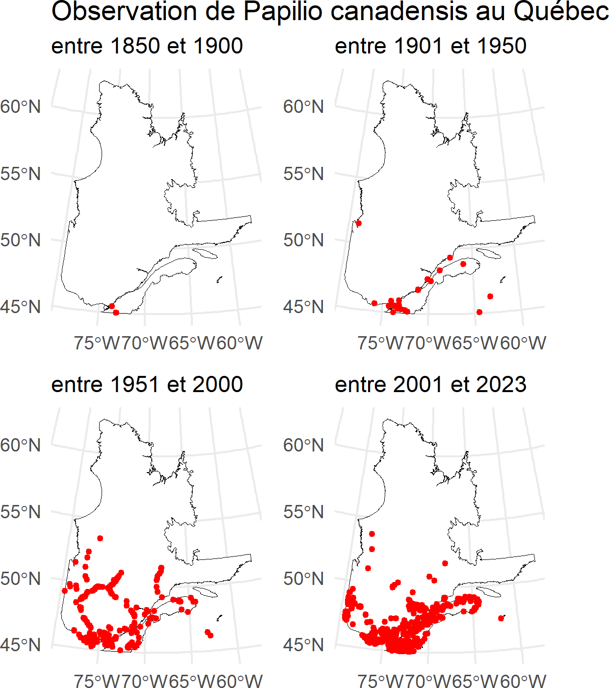

# Introduction et questions de recherche

Les lépidoptères, en tant qu’indicateurs sensibles à la température et aux changements environnementaux [@devictor_differences_2012; @parmesan_poleward_1999], sont particulièrement utiles pour évaluer les effets des perturbations anthropiques, notamment les changements climatiques et l’altération des habitats. Au Québec, plusieurs espèces pourraient voir leur aire de répartition modifiée, soit par l’expansion d’espèces thermophiles vers le nord, soit par un recul des espèces froid-adaptées.  
Dans ce contexte, nous avons étudié l’évolution de la diversité des lépidoptères au Québec, à la fois dans le temps et dans l’espace, en nous basant sur les données de présence collectées depuis environ 150 ans. L’objectif principal est d’évaluer les changements dans la diversité des lépidoptères au Québec à travers ces deux dimensions. Ainsi, la première analyse se pose la question suivante : comment la richesse spécifique des lépidoptères a-t-elle évolué au fil des années ? La deuxième analyse s'interroge sur : comment la diversité et la répartition des lépidoptères ont-elles évolué au fil du temps et selon les régions du Québec ? Enfin, la troisième analyse cherche à répondre à la question suivante : comment la répartition de Papilio canadensis a-t-elle changé au cours du temps et dans l’espace au Québec ?  
Ces résultats permettront de discuter des mécanismes potentiels à l’origine des patrons observés, entre biais d’échantillonnage et signaux biologiques réels, et d’évaluer si la composition des communautés de lépidoptères au Québec reflète une transformation de la biodiversité entomologique.


# Méthode et résultats d'analyse
Ici, est présenté un graphique (Fig. 1) mettant en évidence les variations en termes de nombre d'espèces uniques observés au fil des années. Expliquer pourquoi le nombre unique est utiliser et donc sa pertinence.


```{r fig_graphique_biodiversite, echo=FALSE, fig.width=7, fig.height=5, out.width="90%", fig.cap="Variation du nombre d'espèces de lépidoptères au Québec en fonction du temps."}
knitr::include_graphics("../Figures_analyse/graphique_biodiversite.png")
```

Comme deuxième analyse, elle porte sur une espèce commune au Québec, *Papilio canadensis*, communément appelé Papillon tigré du Canada (Fig. 2). Présenter ici la biologie de l'espèce rapidement et de combien de données ont a utilisés pour créer le graphique. Avec références.


L'analyse portant sur l'espèce permet de décrire comment la répartition de *Papilio canadensis* change dans le temps et l'espace.

```{r fig_cartes_pcanadensis, fullpage-figure, echo=FALSE, fig.width=7, fig.height=6, out.width="100%", fig.cap="Image de la province du Québec et de 4 cartes qui montrent l'évolution de *Papilio canadensis* au fil du temps (fenêtres de 50 ans).", fig.align="left", fig.asp=1}
 
```

Texte ici présentant les résultats de l'analyse 2. Comme on peut le voir sur la Figure 2, on voit que la répartition de *P. canadensis* s'est...

On voit dans cette figure (Fig.3 - ici cartes de l'espèce) que ... On peut donc dire que l'espèce est devenue plus ou moins présente avec le temps...

Maintenant, dans cette section, nous analysons l'évolution de la biodiversité des lépidoptères au fil du temps à travers plusieurs visualisations. Nous allons créer des cartes et des graphiques pour observer les variations et tendances.  
Pour l'étude de la biodiversité des lépidoptères dans le temps et l'espace, une figure regroupant six cartes a été réalisée. Dans cette figure, on observe la carte de la province du Québec qui est notre aire d'étude principale. Les points géographiques de la base de données qui sont à l'extérieur de la province ne sont pas pris en compte. La carte la plus ancienne débute en 1875 et représente les données sur 25 ans, soit de 1875 jusqu'à la fin de 1879, ces bonds de 25 ans de données vont jusqu'aux données les plus récentes, soit en 2024. Cette image permet donc de combiner une analyse temporelle (par tranche de 25 ans) et une agrégation spatiale via une grille hexagonale. En effet, une grille hexagonable est utilisée pour éviter les effets de bord qu'on a avec une grille carrée. De plus, elle permet une meilleure agrégration spatiale. La projection utilisée pour cette carte est EPSG 32198, qui est la projection locale du Québec. Cela permet une représentation précise à l'échelle régionale. Pour finir, une moyenne de nombre d'espèces par cellule pour chaque période de temps a été fait. Ce qui donne une idée plus stable et comparable de la diversité à travers le temps.  
En conclusion, ces 6 cartes sont combinées en une seule image finale, ce qui permet une comparaison visuelle claire de l’évolution spatio-temporelle de la diversité spécifique au Québec. Ce qui est utile visualiser les zones où la diversité augmente, diminue ou reste stable. 

La Figure 4 ci-dessous montrent l'évolution de la biodiversité des lépidoptères pour différentes périodes et critères. 

```{r fig_cartes_combinees, fullpage-figure, echo=FALSE, fig.width=7, fig.height=6, out.width="100%", fig.cap="Image de la province du Québec et de six cartes qui montrent l'évolution de la biodiversité des espèces de lépidoptères au fil du temps (fenêtres de 25 ans).", fig.align="left", fig.asp=1}
knitr::include_graphics("../Figures_analyse/cartes_combinees.png") 
```

Ces cartes illustrent une augmentation progressive de la couverture spatio-temporelle des données au fil des décennies. Plus on avance dans le temps, plus le nombre de cellules remplies augmente, avec des données qui deviennent à la fois plus denses, plus complètes et de plus grande valeurs. 

Un premier point à souligner est que la période allant de 1875 à 1899 comporte très peu de données, principalement concentrées autour des grandes villes comme Montréal, Québec et Sherbrooke. La diversité moyenne est entre faible à modérée, mais les données sont trop rares pour en tirer des conclusions solides. Entre 1900-1934 et 1925-1949, on remarque une progression lente de la couverture grâce à l’accumulation graduelle de données d’échantillonnage. Par contre, l’effort demeure limité, ce qui rend les valeurs de diversité peu fiables, à l’exception des zones urbaines du sud qui sont mieux couvertes.

Entre 1950-1974 et 1975-1999, on remarque l'apparition de cellules de couleur orangée. Le sud et l'ouest du Québec en dehors des zones urbaines sont de plus mieux couvert. Il. y a une meilleure répartition des données dans l'espace.

La majorité du sud du Québec est désormais bien couverte entre les années 2000 et 2024, notamment autour des grands centres urbains et des zones agricoles. On observe également une augmentation de la diversité, illustrée par la présence accrue de cellules en oranger et jaune.

Enfin, pour la période la plus récente (2000-2024), la couverture devient à la fois plus dense et plus étendue à l’échelle du territoire. La diversité moyenne y est généralement plus élevée, ce qui reflète probablement un important renforcement des efforts de suivi, en partie grâce à l’émergence de bases de données participatives comme iNaturalist.


# Discussion

-Analyse 1 :
-Analyse 2 :
-Analyse 3 : Un des biais importants associés à la carte de biodiversité spatio-temporelle réside dans l'augmentation du nombre d'observations au fil du temps, ce qui est attendu étant donné l'évolution des efforts d'échantillonnage. Toutefois, ces données traduisent autant les dynamiques biologiques réelles que l'intensité vriable de l'observation. En effet, les avancées technologiques récentes (comme la génétique ou la modélisation climatique) permettent de mettre en lumière des dynamiques écologiques auparavant invisibles, créant ainsi un décalage interprétatif avec les méthodes historiques. Comme souligné dans une étude, les bases de données naturalistes présentent un effort d'échantillonnage inégal dans le temps et dans l'espace, ce qui peut nuire à la représentativité écologique des cartes produites ().

Cela soulève notamment des questions concernant l'interprétation des zones identifiées comme peu diverisifiées (en rouge). Ces zones reflètent-elles réellement une faible diversité biologique ou simplement un manque d'effort d'échantillonnage? Ce questionnement est d'autant plus pertinent lorsqu'on observe que le sud du Québec, mieux couvert par les inventaires, présente aussi une diversité plus élevée. Par ailleurs, à partir de 1975, on observe une stabilisation du nombre moyen d'espèces dans plusieurs cellules, ce qui pourrait indiquer que l'effort d'échantillonnage devient suffisant pour représenter de façon plus fidèle la diversité locale. 


# Conclusion


# Références bibliographiques

<!-- Leave these lines as they are at the end of your .Rmd file to ensure placement of methods & acknowledgements sections before the references-->
\showmatmethods
\pnasbreak
