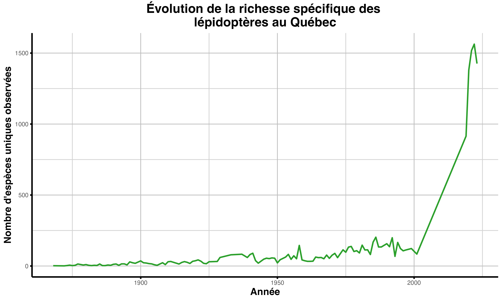
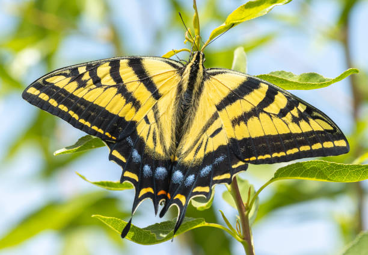
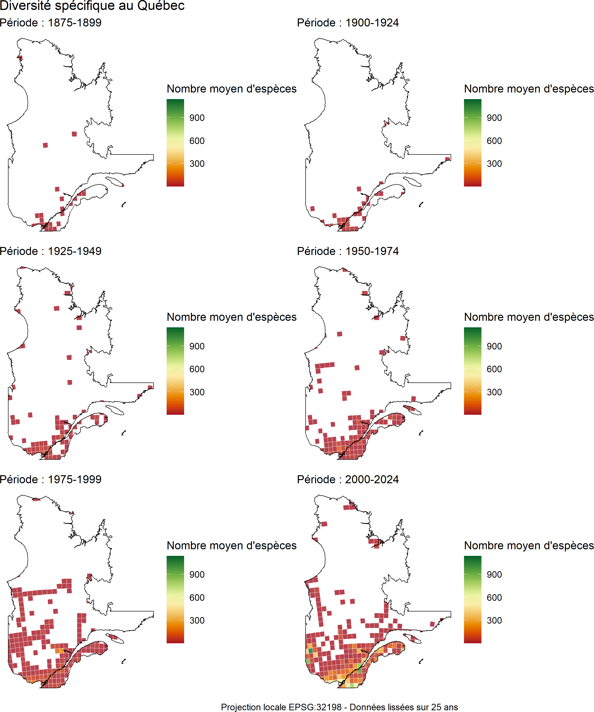

# Introduction et questions de recherche

Les lépidoptères, en tant qu’indicateurs sensibles à la température et aux changements environnementaux [@devictor_differences_2012; @parmesan_poleward_1999], sont particulièrement utiles pour évaluer les effets des perturbations anthropiques, notamment les changements climatiques et l’altération des habitats. Au Québec, plusieurs espèces pourraient voir leur aire de répartition modifiée, soit par l’expansion d’espèces thermophiles vers le nord, soit par un recul des espèces froid-adaptées.  
Dans ce contexte, nous avons étudié l’évolution de la diversité des lépidoptères au Québec, à la fois dans le temps et dans l’espace, en nous basant sur les données de présence collectées depuis environ 150 ans. L’objectif principal est d’évaluer les changements dans la diversité des lépidoptères au Québec à travers ces deux dimensions. Ainsi, la première analyse se pose la question suivante : comment la richesse spécifique des lépidoptères a-t-elle évolué au fil des années ? La deuxième analyse cherche à répondre à la question suivante : comment la répartition de Papilio canadensis a-t-elle changé au cours du temps et dans l’espace au Québec ? Enfin, la troisième analyse s'interroge sur : comment la diversité et la répartition des lépidoptères ont-elles évolué au fil du temps et selon les régions du Québec ?  
Ces résultats permettront de discuter des mécanismes potentiels à l’origine des patrons observés, entre biais d’échantillonnage et signaux biologiques réels, et d’évaluer si la composition des communautés de lépidoptères au Québec reflète une transformation de la biodiversité entomologique.


# Méthode et résultats d'analyse  
Pour la première analyse, le graphique présenté ici (Fig. 1) illustre l'évolution du nombre d'espèces uniques de lépidoptères observées au fil des différentes années au Québec. Ce graphique permet de visualiser les tendances et fluctuations dans la diversité des espèces le long de la ligne du temps dans la province. Cette analyse repose sur un total de XX XXX observations valides réparties entre 1859 et 2024.

Le choix d'illustrer le nombre d'espèces uniques de lépidoptères permet de mieux refléter la diversité réelle des espèces observées, en excluant les doublons et les variations dues à la fréquence des observations. Par exemple, si une même espèce est observée plusieurs fois dans une année, elle ne sera comptée qu'une seule fois, offrant ainsi une vision plus précise des tendances de diversité. Cela permet également d'analyser les fluctuations des populations et l'impact des facteurs environnementaux, comme une variation climatique, sur la présence de certaines espèces.  

```{r fig_graphique_biodiversite, echo=FALSE, fig.width=7, fig.height=5, out.width="90%", fig.cap="Variation du nombre d'espèces de lépidoptères au Québec en fonction du temps."}

```

On y observe une augmentation relativement lente et stable du nombre d’espèces identifiées jusqu’au début des années 2000, suivie d’une hausse extrêmement marquée à partir de 2005-2010, atteignant plus de 1500 espèces uniques observées.

Comme deuxième analyse, elle porte sur une espèce commune au Québec, *Papilio canadensis*, communément appelé Papillon tigré du Canada (Fig. 2). 

```{r fig-papilio, echo=FALSE, out.width='80%', fig.cap="Papillon tigré du Canada (*Papilio canadensis*) observé dans son habitat naturel.", fig.align="center"}

```

Cette espèce est présente dans toutes les provinces et territoires du Canada. Pour le Québec, on peut la trouver de la frontière à 100 km à l’ouest de Radisson. Ce papillon est parfait pour l’étude, car il couvre une grande partie du Québec et est facilement reconnaissable, ce qui en fait un spécimen parfait pour une étude sur la biodiversité des lépidoptères dans le temps au Québec [@layberry_butterflies_1998].

L'analyse portant sur l'espèce permet de décrire comment la répartition de *Papilio canadensis* change dans le temps et l'espace.

```{r fig_cartes_pcanadensis, fullpage-figure, echo=FALSE, fig.width=7, fig.height=6, out.width="100%", fig.cap="Image de la province du Québec et de 4 cartes qui montrent l'évolution de *Papilio canadensis* au fil du temps (fenêtres de 50 ans).", fig.align="left", fig.asp=1}
knitr::include_graphics("cartes_pcanadensis.png") 
```

Les données d’observation de *Papilio Canadensis* ont été combinées en 4 groupes pour obtenir une meilleure visualisation des observations dans le temps (Fig. 3). Ces groupes sont de 1859 à 1900, de 1900 à 1950, de 1950 à 2000 et de 2000 à 2023, soit la dernière année comportant les données. Ces tranches de temps ont été choisies afin de limiter le nombre de graphiques produits et d’avoir une meilleure compréhension de l’évolution au fil des siècles. Un système de présence-absence a été utilisé pour l’ensemble des 50684 sites d’observation. Une marque sur le graphique indiquera si le papillon a été observé sur ce site dans l’intervalle de temps définit.  
Il y a beaucoup plus d’observations avec le temps, soit 7 entre 1859 et 1900, 86 entre 1901 et 1950, 617 entre 1951 et 2000 et 923 entre 2001 et 2023. Entre 1901 et 1950, il y a déjà des observations près de Waskaganish, ces observation seront de plus en plus au nord après ces années. Les observations les plus au nord seront dans les environs de Radisson. On remarque une diminution des observations dans le centre du Québec entre la carte 3 et la carte 4. Les observation de la carte 4 sont beaucoup plus concentrées dans la région du Saint-Laurent et dans le sud-ouest alors que celles de la carte 3 sont plus concentrées a centre de la province. <br>

Maintenant, dans cette section, nous analysons l'évolution de la biodiversité des lépidoptères au fil du temps à travers plusieurs visualisations. Nous allons créer des cartes et des graphiques pour observer les variations et tendances.  
Pour l'étude de la biodiversité des lépidoptères dans le temps et l'espace, une figure regroupant six cartes a été réalisée. Dans cette figure, on observe la carte de la province du Québec qui est notre aire d'étude principale. Les points géographiques de la base de données qui sont à l'extérieur de la province ne sont pas pris en compte. La carte la plus ancienne débute en 1875 et représente les données sur 25 ans, soit de 1875 jusqu'à la fin de 1879, ces bonds de 25 ans de données vont jusqu'aux données les plus récentes, soit en 2024. Cette image permet donc de combiner une analyse temporelle (par tranche de 25 ans) et une agrégation spatiale via une grille hexagonale. En effet, une grille hexagonable est utilisée pour éviter les effets de bord qu'on a avec une grille carrée. De plus, elle permet une meilleure agrégration spatiale. La projection utilisée pour cette carte est EPSG 32198, qui est la projection locale du Québec. Cela permet une représentation précise à l'échelle régionale. Pour finir, une moyenne de nombre d'espèces par cellule pour chaque période de temps a été fait. Ce qui donne une idée plus stable et comparable de la diversité à travers le temps.  
En conclusion, ces 6 cartes sont combinées en une seule image finale, ce qui permet une comparaison visuelle claire de l’évolution spatio-temporelle de la diversité spécifique au Québec. Ce qui est utile visualiser les zones où la diversité augmente, diminue ou reste stable. 

La Figure 4 ci-dessous montrent l'évolution de la biodiversité des lépidoptères pour différentes périodes et critères. 

```{r fig_cartes_combinees, fullpage-figure, echo=FALSE, fig.width=7, fig.height=6, out.width="100%", fig.cap="Image de la province du Québec et de six cartes qui montrent l'évolution de la biodiversité des espèces de lépidoptères au fil du temps (fenêtres de 25 ans).", fig.align="left", fig.asp=1}
 
```

Ces cartes illustrent une augmentation progressive de la couverture spatio-temporelle des données au fil des décennies. Plus on avance dans le temps, plus le nombre de cellules remplies augmente, avec des données qui deviennent à la fois plus denses, plus complètes et de plus grande valeurs. 

Un premier point à souligner est que la période allant de 1875 à 1899 comporte très peu de données, principalement concentrées autour des grandes villes comme Montréal, Québec et Sherbrooke. La diversité moyenne est entre faible à modérée, mais les données sont trop rares pour en tirer des conclusions solides. Entre 1900-1934 et 1925-1949, on remarque une progression lente de la couverture grâce à l’accumulation graduelle de données d’échantillonnage. Par contre, l’effort demeure limité, ce qui rend les valeurs de diversité peu fiables, à l’exception des zones urbaines du sud qui sont mieux couvertes.

Entre 1950-1974 et 1975-1999, on remarque l'apparition de cellules de couleur orangée. Le sud et l'ouest du Québec en dehors des zones urbaines sont de plus mieux couvert. Il. y a une meilleure répartition des données dans l'espace.

La majorité du sud du Québec est désormais bien couverte entre les années 2000 et 2024, notamment autour des grands centres urbains et des zones agricoles. On observe également une augmentation de la diversité, illustrée par la présence accrue de cellules en oranger et jaune.

Enfin, pour la période la plus récente (2000-2024), la couverture devient à la fois plus dense et plus étendue à l’échelle du territoire. La diversité moyenne y est généralement plus élevée, ce qui reflète probablement un important renforcement des efforts de suivi, en partie grâce à l’émergence de bases de données participatives comme iNaturalist.


# Discussion

Pour ce qui est de la première analyse, l'augmentation abrupte du nombre d'espèces de lepidoptères depuis 2005 au niveau de la Figure 1 ne reflète probablement pas une véritable explosion de la biodiversité des lépidoptères, mais plutôt un effort d’échantillonnage et d’identification beaucoup plus important au cours des deux dernières décennies. En effet, plusieurs facteurs peuvent expliquer cette tendance, notamment la montée en puissance de la science participative (avec des plateformes comme iNaturalist et eButterfly), la généralisation de l’utilisation des appareils photo numériques et des outils numériques de reconnaissance d’espèces, ainsi qu’un intérêt grandissant du public et des chercheurs pour la documentation de la biodiversité [@mandeville_participatory_2023]. Ces observations concordent avec les résultats d’une étude récente indiquant que l’augmentation des données disponibles sur la biodiversité depuis le début des années 2000 s’explique en grande partie par l’implication citoyenne croissante et par une couverture spatiale et temporelle des relevés plus étendue [@mandeville_participatory_2023]. 

Au niveau de la deuxième analyse, la figure 3 nous apprend les régions où les papillons ont été observés à travers le temps. On peut constater qu’il y a de plus en plus d’observations au travers des années, ce qui est normal étant donné que le nombre d’observateurs a augmenté et les outils de partage des données ont évolué. Il est intéressant de constater qu’entre la carte 3 et la carte 4, on note une diminution de la population au centre du Québec et une augmentation au sud du Québec et proche de l’Ontario, et ce, malgré un nombre plus important d’observateurs. Il pourrait s’agir d’une diminution de la population dans cette région ou un moins grand effort d’échantillonnage. À part la distribution géographique de l’espèce, cette carte manque d’information pour avoir une meilleure compréhension de la situation. Par exemple, le nombre d’observation par site et le nombre d’observateurs par tranche de temps auraient pu être ajoutés, ce qui nous aurait aidés à faire un meilleur portait de la population au fil du temps. Le nombre d’observateurs nous aurait aussi aidés à connaître la relation entre l’augmentation d’observation et l’effort d’observation.

Finalement, pour la troisième analyse, un des biais importants associés à la carte de biodiversité spatio-temporelle réside dans l'augmentation du nombre d'observations au fil du temps, ce qui est attendu étant donné l'évolution des efforts d'échantillonnage. Toutefois, ces données traduisent autant les dynamiques biologiques réelles que l'intensité vriable de l'observation. En effet, les avancées technologiques récentes (comme la génétique ou la modélisation climatique) permettent de mettre en lumière des dynamiques écologiques auparavant invisibles, créant ainsi un décalage interprétatif avec les méthodes historiques. Comme souligné dans une étude, les bases de données naturalistes présentent un effort d'échantillonnage inégal dans le temps et dans l'espace, ce qui peut nuire à la représentativité écologique des cartes produites [@navarro_modelisation_2021].

Cela soulève notamment des questions concernant l'interprétation des zones identifiées comme peu diverisifiées (en rouge). Ces zones reflètent-elles réellement une faible diversité biologique ou simplement un manque d'effort d'échantillonnage? Ce questionnement est d'autant plus pertinent lorsqu'on observe que le sud du Québec, mieux couvert par les inventaires, présente aussi une diversité plus élevée [@hillebrand_generality_2004]. Par ailleurs, à partir de 1975, on observe une stabilisation du nombre moyen d'espèces dans plusieurs cellules, ce qui pourrait indiquer que l'effort d'échantillonnage devient suffisant pour représenter de façon plus fidèle la diversité locale. 


# Conclusion

Il demeure donc essentiel de tenir compte de l’effort d’échantillonnage afin d’éviter de surévaluer les tendances à long terme en matière de biodiversité.


# Références bibliographiques

<!-- Leave these lines as they are at the end of your .Rmd file to ensure placement of methods & acknowledgements sections before the references-->
\showmatmethods
\pnasbreak
