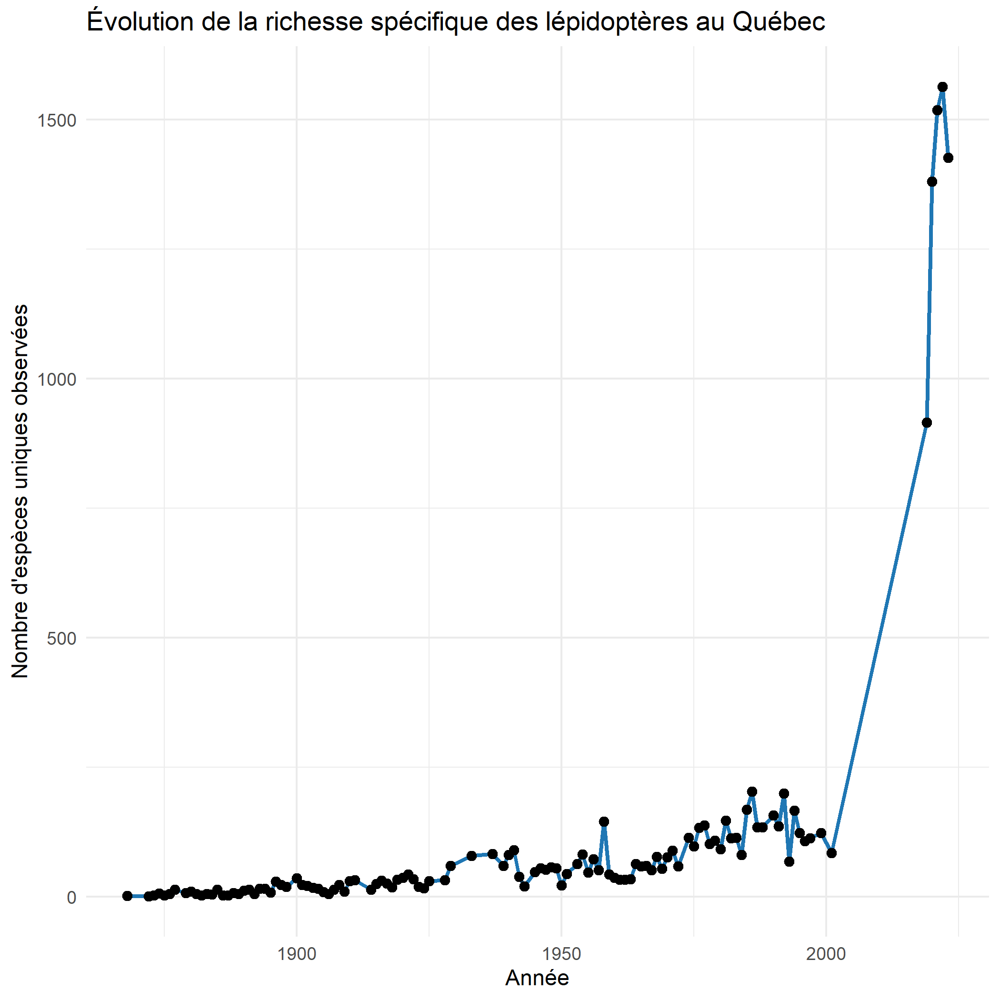
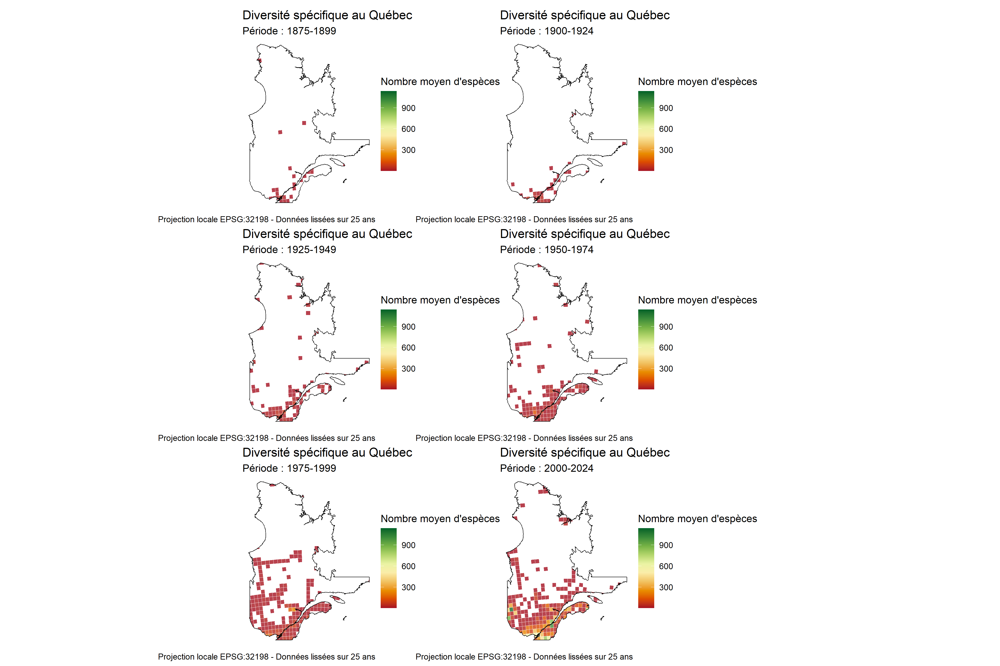

Le rapport doit contenir :
3 figures
Un titre et un résumé
Une courte introduction spécifiant les questions
Une courte description de la méthode et des résultats
Une discussion, enrichie de citations provenant de la littérature scientifique
Références interne aux figures et à la bibliographie
L'ensemble du texte doit faire 1000-1500 mots max
Une bibliographie

## Nos questions de recherche

**Question principale** :  
Quels sont les changements dans la biodiversité des espèces de lépidoptères dans le temps et dans l’espace au Québec ?

Questions spécifiques (1 sur la variation temporelle et 2 sur la variation temporelle+spatiale) :
**Variation temporelle** :
Analyse 1 : 
Comment la diversité des espèces de lépidoptères a-t-elle évoluée au fil des années?

**Variation temporelle et spatiale** : 
Analyse 2 : Comment la diversité et la répartition des espèces de lépidoptères a-t-elle évoluée au fil des années?
Analyse 3 : Comment la répartition de Papilio canadensis change dans le temps et l'espace? 


Format {#format .unnumbered}
------

Many authors find it useful to organize their manuscripts with the
following order of sections; Title, Author Affiliation, Keywords,
Abstract, Significance Statement, Results, Discussion, Materials and
methods, Acknowledgments, and References. Other orders and headings are
permitted.

References {#references .unnumbered}
----------

References should be cited in numerical order as they appear in text;
this will be done automatically via bibtex, e.g. @belkin2002using and
@berard1994embedding [@coifman2005geometric]. All references, including
for the SI, should be included in the main manuscript file. References
appearing in both sections should not be duplicated. SI references
included in tables should be included with the main reference section.


Résultats {#Résultats .unnumbered}
-------------------------
Ici, est présenté un graphique (Fig. 1) mettant en évidence les variations en termes de nombre d'espèces uniques observés au fil des années. Expliquer pourquoi le nombre unique est utiliser et donc sa pertinence.

```{r fig_graphique_biodiversite, echo=FALSE, fig.width=7, fig.height=6, out.width="90%", fig.cap="Variation du nombre d'espèces de lépidoptères au Québec en fonction du temps."}

```

Comme deuxième analyse, elle porte sur une espèce commune au Québec, *Papilio canadensis*, communément appelé Papillon tigré du Canada (Fig. 2). Présenter ici la biologie de l'espèce rapidement et de combien de données ont a utilisés pour créer le graphique. Avec références bibliographiques.


L'analyse portant sur l'espèce permet de décrire comment la répartition de *Papilio canadensis* change dans le temps et l'espace.

![Répartition de Papilio canadensis au Québec au fil des années.<span data-label="fig:papilio"></span>]
#ajouter un png de notre figure obtenue dans un code chunk comme les autres figures d'analyse.

On voit dans cette figure (Fig.3 - ici cartes de l'espece) que ...On peut donc dire que l'espèce est devenue plus/moins présente avec le temps...

Maintenant, dans cette section, nous analysons l'évolution de la biodiversité des lépidoptères au fil du temps à travers plusieurs visualisations. Nous allons créer des cartes et des graphiques pour observer les variations et tendances.


## **Méthodes**


### Cartes de biodiveristé spatio-temporelle

Pour l'étude de la biodiversité des Lépidoptère dans le temps et l'espace, une image regroupant six cartes a été produites. Dans cette image, on observe la carte de la province du Québec qui est notre air d'étude principale. Les points géographiques de la base de données qui sont à l'extérieur de la province ne sont pas pris en compte. La carte la plus anciennes débute en 1875 et représente les données sur 25 ans, soit de 1875 jusqu'à la fin de 1879, ces bonds de 25 ans de données vont jusqu'au données les plus récentes, soit en 2024. Cette image permet donc de combiner une analyse temporelle (par tranche de 25 ans) et une agrégation spatiale via une grille hexagonale. En effet, une grille hexagonable est utilisée pour éviter les effets de bord qu'on a avec une grilles carrées. De plus, elle permet une meilleure agégration spatiale. La projection utilisée pour cette carte est EPSG 32198 qui est la projection locale du Québec. Cela permet une représentation précise à l'échelle régionale. Pour finir, une moyenne de nombre d'espèces par cellule pour chaque période de temps a été fait. Ce qui donne une idée plus stable et comparable de la diversité à travers le temps.
En conclusion, ces 6 cartes sont combinées en une seule image finale, ce qui permet une comparaison visuelle claire de l’évolution spatio-temporelle de la diversité spécifique au Québec. Ce qui est utile visualiser les zones où la diversité augmente, diminue ou reste stable. 


## Visualisation des données

Les graphiques ci-dessous montrent l'évolution de la biodiversité des lépidoptères pour différentes périodes et critères. Nous avons créé six graphiques pour illustrer les tendances dans les données des lépidoptères.


```{r fig_cartes_combinees, fullpage-figure, echo=FALSE, fig.width=7, fig.height=6, out.width="100%", fig.cap="Image de la province du Québec et de six cartes qui montrent l'évolution de la biodiversité des espèces de lépidoptères au fil du temps (fenêtres de 25 ans).", fig.align="left", fig.asp=1}

```

## **Résultats**


### Cartes de biodiveristé spatio-temporelle

Ces cartes montrent une augmentation de la couverture spatio-temporelle des données au fil des décennies. Plus on avance dans le temps, plus il y a des cellules remplies et plus les données sont denses et complètes. On voit aussi une légère augmentation du nombre d'espèces dans certaines régions, mais cette tendance est influencée par autre chose.

Un premier point important a aborder est que entre 1975 et 1899 il y a très peu de données et celle-ci sont concetrées autour de grandes villes comme Montréal, Québec, Sherbrooke, etc. La diversité moyenne pour cette période est faible à modérée, mais les données sont trop rares pour conclure quelques choses.  Si on s'attarde entre 1900-1934 et 1925-1949, on remarque uen progression lente de la couverture via les données d'échantillonnage. Il y a encore peu d'échantillons, donc les valeurs de diveristé sont peu fiables. Les zones urbaines du sud par contre sont bien couvertes. De 1950-1974, on voit une nette amélioration de la couverture, des cellules commencent à atteindre une diversité de 7-9 espèces en moyenne dans le sud de la province. Par contre, de 1975-1999, il y a un essort de données. La majorité du sud du Québec est maintenant couverte, surtout autour des grands centres et zones garicoles. On remarque aussi plus de verts ce qui indique une augmentation du nombre d'espèces osbervées. Pour notre dernière plage de temps, de 2000-2024, il y a une couverture plus dense et étendue. La diversité moyenne est plus élevée dans plusieurs régions. Cela est probablement lié à une explosion des efforts de suivi, l'arrivée de bases de données en ligne comme iNaturalist.


## **Analyse**

### Cartes de biodiveristé spatio-temporelle

Un biais de la cartes de biodiversité spatio-temporelle est que plus on avance dans le temps plus il y a d'osbervation ce qui logique. Par contre, ces données reflétent aussi les efforts d'échantillonnage autant que la réalité biologique. Ce qui mène aussi à se poser la question pour les zones en rouges (faible diveristé) si elles représentent réellement peu d'espèces ou simlement un manque de points d'échantillonnage. De plus, le sud du Québec est a plus de données et c'est aussi la qu'on remarque une augmentation de la diveristé. D'autre part, à partir de 1975, on voit une bonne stabilisation du nombre d'espèces moyen dans plusieurs cellules, ce qui pourrait refléter un effort d'échantillonnage suffisant pour capter la vrai diversité locale.


<!-- Leave these lines as they are at the end of your .Rmd file to ensure placement of methods & acknowledgements sections before the references-->
\showmatmethods
\showacknow
\pnasbreak
